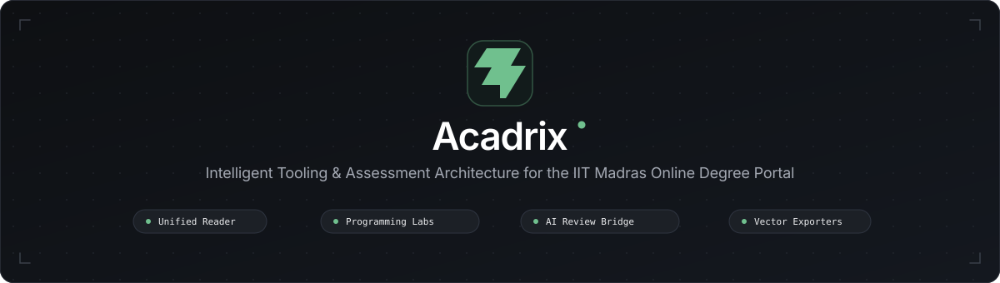

<p align="center">
  
</p>

<h1 align="center">Acadrix</h1>

<p align="center"><strong>A browser extension for reviewing IIT Madras Online Degree assessments and programming assignments.</strong></p>

<p align="center">
  <a href="LICENSE"></a>
  <a href="https://github.com/SH1SHANK/unfold-iitm/releases"></a>
  <a href="https://github.com/SH1SHANK/unfold-iitm/actions/workflows/ci.yml"></a>
  
</p>

Acadrix brings an IITM assessment’s questions into one Reader, supports a review-and-apply workflow for normal assignment answers, and provides an extension-owned code editor for programming assignments. It also exports assignment documents and displays academic event reminders.

## Features

- **Assessment Reader:** traverses question navigation and presents extracted content together in an extension-owned Shadow DOM surface.
- **Answer review:** generates prompts for an external AI assistant, parses indexed answer suggestions, lets the student review them, and applies confirmed answers to the portal.
- **Programming workspace:** extracts programming problem details and test cases. On the actual programming editor page, an embedded CodeMirror editor keeps a local `workingCode` buffer separate from IITM’s Ace editor until the student chooses **Apply Changes**.
- **Export:** creates Markdown, PDF/print output, and portable bundles with assessment-linked resources.
- **Academic events:** reads the configured public academic-events feed, caches results locally, and schedules browser notifications.

Acadrix does not provide an integrated AI service. Prompts are prepared for the student to copy to an external service; sharing them is the student’s choice. See [Security](docs/SECURITY.md) for network and permissions details.

## Preview

<p align="center"></p>
<p align="center"></p>

## Programming assignments

Acadrix distinguishes the programming assignment information page from the active coding page: the programming launcher is for the actual editor page, not the information page. The extension’s CodeMirror editor supports syntax highlighting, completion, indentation, editing, clipboard operations, and undo/redo for the supported languages. IITM’s Ace editor remains the portal’s source of truth.

When the student applies code, Acadrix uses the privileged extension write path, verifies the editor/question context, replaces only the editable range, and checks that protected scaffold content remains intact. Acadrix does not run or submit the assignment for the student.

See [Programming assignments](docs/PROGRAMMING_ASSIGNMENTS.md) for the data flow and safeguards.

## Normal assignment answer format

The canonical interchange format is indexed by question number:

```text
1: A
2: B,C
3: 1000
4: here
```

The Reader validates suggestions and requires the student to apply them; it does not submit the assessment. See [Answer protocol](docs/ANSWER_PROTOCOL.md).

## Installation

The repository builds a Manifest V3 extension. Node.js 22 is used by CI; install dependencies from the lockfile and build the unpacked extension:

```bash
git clone https://github.com/SH1SHANK/unfold-iitm.git
cd unfold-iitm
npm ci
node build.mjs
```

In Chrome or another Chromium browser, open `chrome://extensions`, enable Developer mode, choose **Load unpacked**, and select the generated `build/` directory. Refresh the IITM portal page after loading or reloading the extension.

## Development and testing

```bash
npm ci
node build.mjs
npm run check
npm test
```

`npm test` runs the deterministic Node-based suite, including architecture verification and programming-assignment checks. Browser tests are separate and require a locally available Chrome/Chromium installation:

```bash
npm run test:browser
```

See [Development](docs/DEVELOPMENT.md) and [Testing](docs/TESTING.md) for details and limitations.

## Releases

The repository contains versioned release automation. Published versions and their artifacts, when available, are listed on [GitHub Releases](https://github.com/SH1SHANK/unfold-iitm/releases). Release automation does not run as part of the ordinary CI build.

## Documentation

- [Features](docs/FEATURES.md)
- [Architecture](docs/ARCHITECTURE.md)
- [Programming assignments](docs/PROGRAMMING_ASSIGNMENTS.md)
- [Normal-assignment answer protocol](docs/ANSWER_PROTOCOL.md)
- [Security and permissions](docs/SECURITY.md)
- [Testing](docs/TESTING.md)
- [Development](docs/DEVELOPMENT.md)
- [Contributing](docs/CONTRIBUTING.md)
- [Design system](DESIGN.md)
- [Architecture decisions](docs/decisions/README.md)
- [Architecture diagram](docs/diagrams/acadrix-architecture.html)
- [Apply Changes sequence](docs/diagrams/apply-changes-pipeline.html)

## Contributing

See [CONTRIBUTING.md](CONTRIBUTING.md) for the contribution guide and [`.github/PULL_REQUEST_TEMPLATE.md`](.github/PULL_REQUEST_TEMPLATE.md) for the review checklist.

## Security

Please report vulnerabilities privately using GitHub’s [security reporting](https://github.com/SH1SHANK/unfold-iitm/security/advisories/new). See [SECURITY.md](docs/SECURITY.md) for the implemented security boundaries and network behavior.

## License

Acadrix is distributed under the [MIT License](LICENSE).
